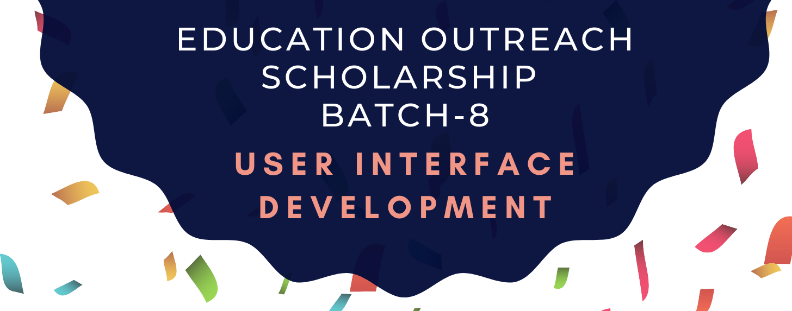

# UI Development : GirlScript Education Outreach

## [Course Website](https://ribtas007.github.io/GS-EOP-UI-Development/ )

This is a 7 day bootcamp of UI Development which will cover almost all the basics required to kickstart UI Development.

Mentored by : [Ritika Gupta](https://www.linkedin.com/in/gritika1906/)

Platforms used : [jsfiddle](https://jsfiddle.net/) and [codepen.io](https://codepen.io/collection/AQPkmq )

***

## Course Structure

DAY | Topics Covered 
--- | --- 
1 | Grooming session on UI Development
2 | Kickstart to UI Development
3 | Adding Visual styles to UI I 
4 | Adding Visual styles to UI II
5 | Introduction to CSS preprocessors
6 | Making a Web Resume 
7 | Wrap-Up Session 

***

